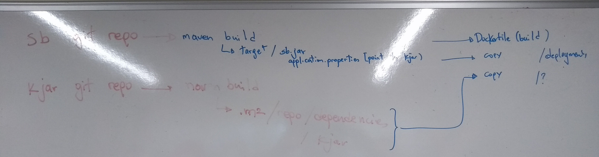

= Business Automation -  Springboot Runtime App
:toc:

== The Aim 

* A re-usable Springboot Busines Application with _minimal_ dependencies to provide a Runtime for JBPM/Drools (RHPAM/RHDM) business projects

 

== The Requirements

1. *MUST:* be possible to load/expose a KJAR (KieContainer) by simply giving a GIT repository
2. *MUST:* Absolute minimum dependencies must be https://maven.repository.redhat.com/ga[Red Hat public maven artifacts] and availability of http://maven.apache.org/download.cgi?Preferred=ftp://mirror.reverse.net/pub/apache/[maven binary] 
3. *MUST:* I want to not be hindered by environmental dependencies what are these? (DB, NEXUS, ALL NEXUS Dependencies require in the image, Security for roles) in trying this out
4. *Nice to Have:* I would like to have the option to externalize DB (with minimum -maven/springboot profile- effort)
5. *Nice to Have:* I would like to have Monitoring via RHPAM Monitor/Business Central possible)
6. *Must Have:* CICD pipeline with Jenkins to satisfy
* a) To install the KJARs in NEXUS server (normal CICD Lifecycle each KJAR has its own pipeline for release)
* b) To configure the Springboot Service App via  `pom.xml` pointing to KJARs in MAVEN (Nexus/Artifactory) repository
* c) Configure the Springboot Service App with the correct kie-server-state file (can be automated)
* d) To include the repo of dependencies in for KJARs in the image
* e) To release/rollout new versions of the Springboot Service App
* f) To rollout to other namespaces

== How To Use this Repo
[[anchor-1]]
IMPORTANT: Important: Before using note that by default this App provides the minimum configurations for SpringBoot KJAR Service. See xref:anchor-7[How To Further Configure the App]

1. _Fork_ this repository for every new service (ie. this is just a baseline) and update *pom.xml* with new *GAV*.
2. Build and install in your local/central MAVEN repository the xref:anchor-5[Plugin for building KJAR Dependencies]

=== How To Use as locally Springboot App
[[anchor-2]]

first start at xref:anchor-1[How To Use this Repo]

1. _Run_ *JenkinspipelineBatch.sh* script to create KJARs binaries, a repository of their dependencies (along with the KJARs installed in it), configurations for the Springboot Runtime App (`your-service-name.xml` kie-server-state, `application-XXX.properties`) based on what is to run
* *[Parameter 1]* a list of KJARs to be loaded into Springboot App. The list must have the following format `containerAlias-1#RuntimeStrategy#GIT_REPO-1,containerAlias-2#RuntimeStrategy#GIT_REPO-2,containerAlias-N#RuntimeStrategy#GIT_REPO-N`
* *[Parameter 2]* Name of Business Service (will be used for `kie-server-state` config file name, `application-xxx.properties` configurations `kieserver.serverId`, `kieserver.Name`)
* example:

	 ./JenkinspipelineBatch.sh basic#PER_PROCESS_INSTANCE#https://github.com/skoussou/basic-kjar,retail#PER_CASE#https://github.com/skoussou/example-retail-credit-kjar business-application-service

2. Run the Service as local SpringBoot App and xref:anchor-6[Use the KJAR Springboot Service APIs]
* No external DB dependencies

	mvn spring-boot:run -Dspring-boot.run.profiles=h2 -Dspring-boot.run.jvmArguments="-Dkie.maven.settings.custom=settings-local-only.xml  -Dorg.kie.server.startup.strategy=LocalContainersStartupStrategy"

* use *-Dspring-boot.run.profiles=mysql* and *-P mysql* to use with an external Mysql database and update *_src/main/resources/application-mysql.properties_* with DB connection details
* use *-Dspring-boot.run.profiles=postgres* and *-P postgres* to use with an external PostgresSQL database and update *_src/main/resources/application-postgres.properties_* with DB connection details

=== How To Use as local Docker container
[[anchor-3]]
	TBD

=== How To Use in Openshift 
[[anchor-4]]

first start at xref:anchor-1[How To Use this Repo]

1. Configure in `pom.xml` under https://github.com/skoussou/springboot-business-app/blob/master/pom.xml#L87[artifacts section] the KJARs you plan to deploy in your service (*Important:* KJARs need to be deployed in NEXUS if using a central maven repo. See xref:anchor-8[How To Deploy a KJAR into Central Maven Repo])

        <artifacts>
            <gav>com.redhat:basic-kjar:1.0.0</gav>
            <gav>com.redhat:basic-kjar:2.0.0</gav>
            <gav>com.redhat:example-retail-credit-kjar:1.0.0</gav>
        </artifacts>

2. Configure `your-service-name.xml` (see `business-application-service.xml` as an example and must match `application-openshift.properties` properties `kieserver.serverId`, `kieserver.Name`) 
* one *<container>* for each KJAR above

3. Configure the `artifactId` and version based on your pom.xml in the https://github.com/skoussou/springboot-business-app/blob/master/Dockerfile#L6[`Dockerfile`]

4. Configure database connection details in `application-openshift.properties` to connect to either an _external database_ or create a MySQL database service in openshift 

* Create necessary *mysql* database service dependency (see `application-openshift.properties`)

	#data source configuration
	spring.datasource.username=jbpm
	spring.datasource.password=jbpm
	spring.datasource.url=jdbc:mysql://pam-mysql:3306/jbpm

	$ oc new-app --template=mysql-ephemeral -p DATABASE_SERVICE_NAME=pam-mysql -p MYSQL_USER=jbpm -p MYSQL_PASSWORD=jbpm -p MYSQL_ROOT_PASSWORD=root -p MYSQL_DATABASE=jbpm

==== Run the service in K8s/Openshift cluster (fabric8) - NON-CICD

first start at xref:anchor-4[How To Use in Openshift]

1. Use the *openshift* profile to *Build App*, *Build KJAR Maven Dependencies Repo*, *Build Image with Repo*, *Create resoures bc/dc*
** Build and deploy in OCP

	mvn clean package -DskipTests=true -P openshift -Dmaven.artifact.threads=50 -s settings-nexus.xml
	mvn fabric8:deploy -Dfabric8.namespace=dev-pam -DskipTests=true -P openshift -Dmaven.artifact.threads=50 -s settings-nexus.xml

** Check the created OCP resources

	oc get all -l app=business-application-service
	oc get all -l version=2.2.14

2.  Get to Swagger API and xref:anchor-6[Use the KJAR Springboot Service APIs]

	[ROUTE_URL]rest/api-docs?url=../rest/server/swagger.json	(user/user)

==== Run the Service (CICD) in Openshift

first start at xref:anchor-4[How To Use in Openshift]

1. OCP Secrets/ServiceAccount Setups if working on your own Cluster
* Bind *_edit_* role to *cicd-pam* group or to group which is used in the CICD Jenkins namespace to be able to *_edit_* the namespace where buildsConfigs, deploymentConfigs, builds etc. will be configured in

	oc policy add-role-to-group edit system:serviceaccounts:cicd-pam -n ${NAMESPACE_WHERE_SERVICE_WILL_BE_DEPLOYED}

* have a secret containing the *redhat.registry.io* credentials for pulling images (this can be done by OCP Infra so this task is if you manage your own server)

	oc create secret generic imagestreamsecret --from-file=.dockerconfigjson=/home/stkousso/.docker/config.json --type=kubernetes.io/dockerconfigjson

* associate the _imagestreamsecret_, within the namespace which will receive the _Jenkinspipeline_ builds and will be required to pull images/create new images, with the relevant *_serviceaccount_*

        oc secrets link builder imagestreamsecret --for=pull
        oc secrets link builder imagestreamsecret

2. Add a Jenkins job baed on the *Jenkinsfile* in this repository in your Jenkins and configure the parameters at the top of the file to the correct namespaces
4. Updates to `pom.xml` require updates of version in `Dockerfile` version 
3.  Get to Swagger API and xref:anchor-6[Use the KJAR Springboot Service APIs]

	[ROUTE_URL]rest/api-docs?url=../rest/server/swagger.json	(user/user)

[[anchor-5]]
== Plugin for building KJAR Dependencies

* The plugin will build KJAR dependencies

	git clone https://github.com/ippul/offliner-maven-plugin.git
	cd offliner-maven-plugin
	add to pom.xml
        ---------------------------	
	<distributionManagement>
	  <repository>
	    <id>releases</id>
	      <url>http://nexus-cicd-pam.apps.cluster-rhpam-109e.rhpam-109e.example.opentlc.com/repository/maven-releases/</url>
	  </repository>
	  <snapshotRepository>
	    <id>snapshots</id>
	    <url>http://nexus-cicd-pam.apps.cluster-rhpam-109e.rhpam-109e.example.opentlc.com/repository/maven-snapshots/</url>
	  </snapshotRepository>
	</distributionManagement>
        ---------------------------	

With https://github.com/skoussou/basic-kjar/blob/b4a11571cc099203ecfd0cf08b11f6957c56842d/settings.xml#L12[server configs in settings.xml matching the distributionManagement ids] 

	mvn clean deploy -s 

[[anchor-6]]
== KJAR Springboot Service APIs
* Get Containers List

	curl -u 'user:user' -X GET --header 'Accept: application/json' 'http://127.0.0.1:8090/rest/server/containers'
	curl -u 'user:user' -X GET --header 'Accept: application/json' 'http://business-application-service-dev-pam.apps.cluster-workshop-d20a.workshop-d20a.example.opentlc.com/rest/server/containers'

* Find Process IDs in KIEContainer

	curl -k -u user:user -X GET "http://127.0.0.1:8090/rest/server/containers/retail/processes/" -H "accept: application/json"
	curl -k -u user:user -X GET "http://business-application-service-dev-pam.apps.cluster-workshop-d20a.workshop-d20a.example.opentlc.com/rest/server/containers/{ALIAS or CONTAINERID}/processes/" -H "accept: application/json"

* Find Process Details(eg. process Variables) based on Process ID

	curl -k -u user:user -X GET "http://127.0.0.1:8090/rest/server/containers/retail/processes/definitions/my-process" -H "accept: application/json"
	curl -k -u user:user -X GET "http://business-application-service-dev-pam.apps.cluster-workshop-d20a.workshop-d20a.example.opentlc.com/rest/server/containers/containers/{ALIAS or CONTAINERID}/processes/definitions/{ProcessID}" -H "accept: application/json"

* Start Process

	curl -u 'user:user' -X POST --header 'Content-Type: application/json' --header 'Accept: application/json' -d '{}' 'http://127.0.0.1:8090/rest/server/containers/{ALIAS or CONTAINERID}/processes/{ProcessID}/instances'
	eg. curl -u 'user:user' -X POST --header 'Content-Type: application/json' --header 'Accept: application/json' -d '{}' 'http://127.0.0.1:8090/rest/server/containers/retail/processes/my-process/instances'
	curl -u 'user:user' -X POST --header 'Content-Type: application/json' --header 'Accept: application/json' -d '{}' 'http://business-application-service-dev-pam.apps.cluster-workshop-d20a.workshop-d20a.example.opentlc.com/rest/server/containers/basic-kjar-2.0.0/processes/my-process/instances'

* Retrieve instances of processes in KIEContainer (status 1=Active, 2=Completed, 3=Error)

	curl -u 'user:user' -X GET  "http://127.0.0.1:8090/rest/server/containers/example-retail-credit-kjar-1.0.0/processes/instances?status=2&page=0&pageSize=10&sortOrder=true" -H "accept: application/json" -H "content-type: application/json"
	curl -k -u user:user -X GET "http://business-application-service-dev-pam.apps.cluster-workshop-d20a.workshop-d20a.example.opentlc.com/rest/server/containers/{CONTAINER_ID}/processes/instances?status=2&page=0&pageSize=10&sortOrder=true" -H "accept: application/json" -H "content-type: application/json"

[[anchor-7]]
== How To Further Configure the App

1. Security (Adding Users/External Security)
2. Database
3. Timers
4. APIs

== How To Deploy a KJAR into Central Maven Repo
[[anchor-8]]
* See example at: https://github.com/skoussou/basic-kjar/blob/b4a11571cc099203ecfd0cf08b11f6957c56842d/pom.xml#L9[Basic KJAR distributionManagement]
* With https://github.com/skoussou/basic-kjar/blob/b4a11571cc099203ecfd0cf08b11f6957c56842d/settings.xml#L12[server configs in settings.xml matching the distributionManagement ids] execute:

	mvn clean deploy -s settings.xml

Resources: Docs on Openshift DSL Pipeline creation

* Logging into cluster https://github.com/jenkinsci/openshift-client-plugin#configuring-an-openshift-cluster[via openshift.withCluster] 

	openshift.withCluster( 'mytempcloudcluster' ) {
	    // ... operations relative to this cluster ...
	}

